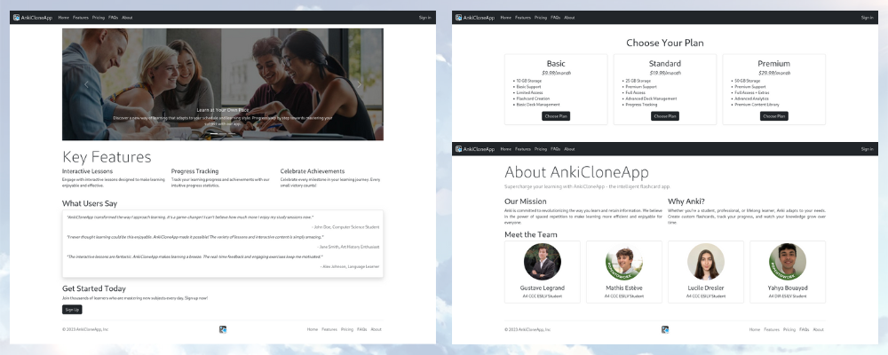
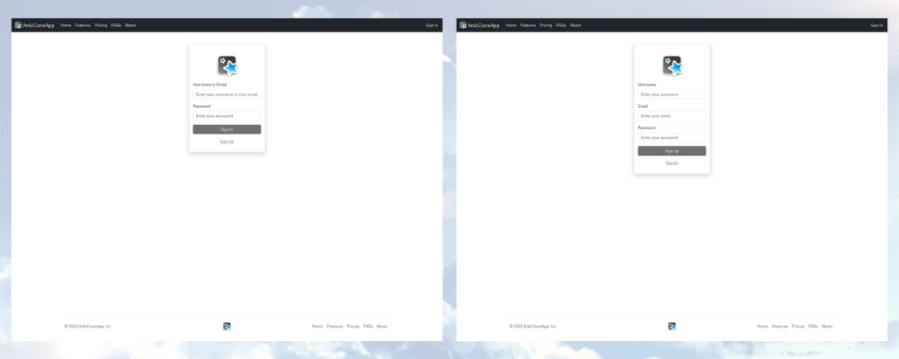
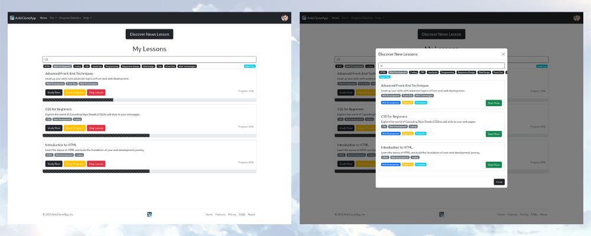
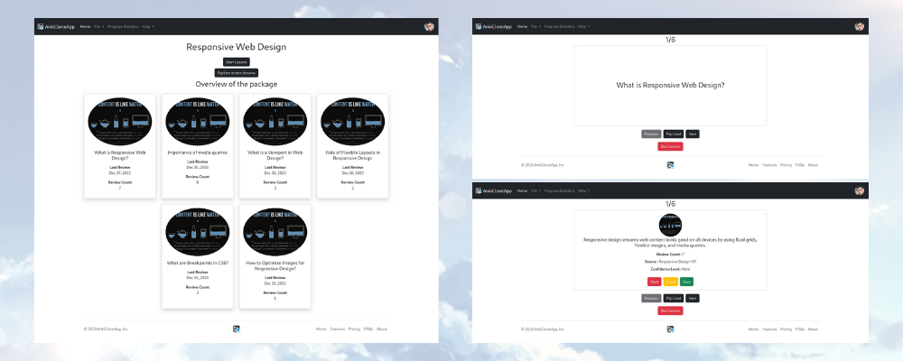
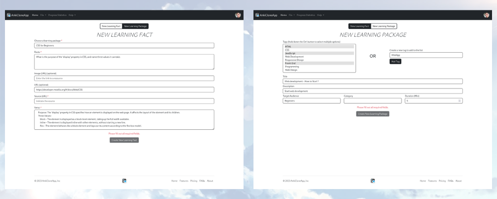
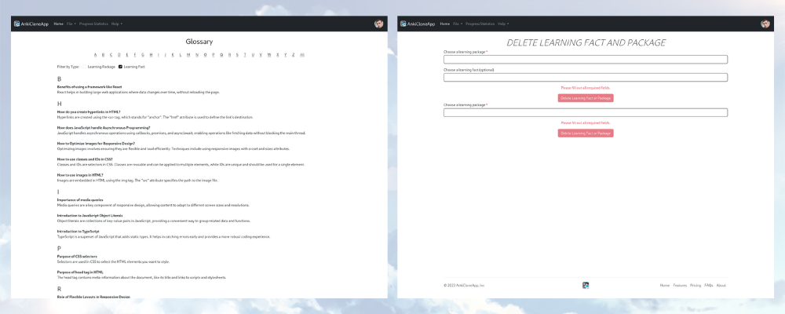
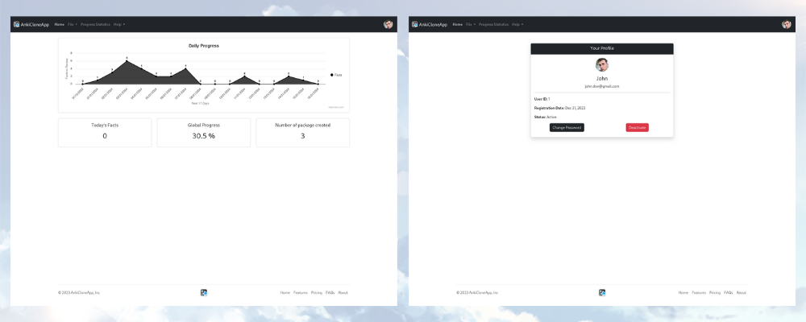
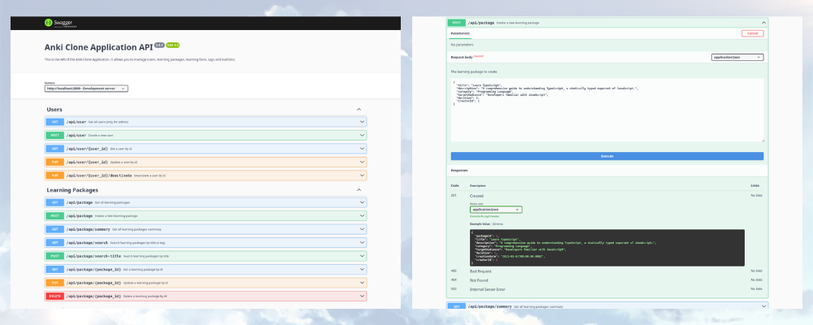
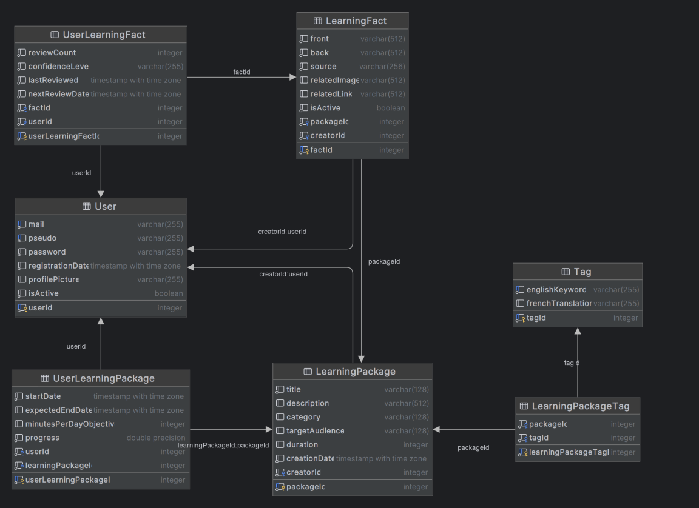

# AnkiCloneApp - The best way to learn

## 📚 Table of Contents

- [About](#about)
- [Run Locally](#run-locally)
- [Frontend overview](#frontend-overview)
- [API overview](#api-overview)
- [Database overview](#database-overview)

***

## 📝 About

AnkiCloneApp is a web application that allows users to create flashcards and study them using the spaced repetition technique.
Our goal is to help people learn more efficiently and effectively by moving the traditional Anki Desktop application to the web, making it more accessible and easier to use.

With a team of 4 developers, we built this application using the following technologies:

- **Frontend:** Angular, TypeScript, HTML, CSS, ng-Bootstrap
- **Backend:** Node.js, Express.js, TypeScript
- **Database:** PostgreSQL

Let's preview the application!

## 🏃‍♂️ Run Locally

To run the application locally, you need to follow the steps detailed on the [BUILD.md](./BUILD.md) file.
It will guide you through the process of setting up the database, the API and the frontend.

## 🖥 Frontend overview

The frontend is built using Angular, a TypeScript-based open-source web application framework led by the Angular Team at Google and by a community of individuals and corporations.
This framework allows us to build a Single Page Application (SPA) that provides a better user experience by loading the entire application on the first request and then dynamically updating the page when the user interacts with it.

First, you will land on the home page, where you can see an overview of the application and the main features. You will be able to navigate to the `pricing` page and the `about` page.

- [Home page](http://localhost:4200/home), [Pricing page](http://localhost:4200/pricing), [About page](http://localhost:4200/about)

Then, you can navigate to the `login` page, where you can log in to your account. If you don't have an account yet, you can navigate to the `sign-up` page and create one.

- [Login page](http://localhost:4200/login), [Sign-up page](http://localhost:4200/sign-up)

After logging in, you will be redirected to the `home` page. Your navigation bar will change, and you will be able to navigate to the `file` page, the `progress statistics` page and the `help` page. You will also be able to log out and access your profile.

Under `file`, you will be able to explore your lessons. This page will show you all the lessons you have started.
This page will also allow you to filter your lessons by name and by tags.
You will have an overview of your progress for each lesson, and you will be able `study now`, `reset progress` or `stop` the lesson.
Another button on this page will allow you to discover new lessons. It will show you a dialog with all the lessons available on the platform.
You will be able to filter them by name and by tags. You will also be able to start a lesson from this dialog.

- [Explore lessons page](http://localhost:4200/explore-lesson)

When you start a lesson, you will be redirected to the `study-now` page. This page will show you an overview of the lesson, and you will be able to start studying.
With this overview, you will be able to see your `last review` and your `review count`. It will help you to study more efficiently the most important lessons.
When you start the lesson, you will be able to see the first card. You will be able to flip the card, and you will be able to rate your answer.
Depending on your answer, you will see the next card sooner or later. You will also be able to see your progress on the lesson.

- [Study now page](http://localhost:4200/study-now)

As a user, you will be able to create packages or facts for the community. You will be able to navigate to the `new-card` page and the `new-package` page.
To create a learning fact, you will choose the package you want to add it to, and you will be able to add the question and the answer as well as an image, and a source.
Be careful, you will have to put URLs for the image and the source. Then, to create a package, you will have to choose existing tags or create new ones.
You will also have to choose a title, a description, the target audience, the category and the duration of the lesson.

- [New card page](http://localhost:4200/new-card), [New package page](http://localhost:4200/new-package)

When you create a package, you will be able to see it on the `glossary` page. You will also be able to see it on the `explore lessons`.
On the glossary page, you will be able to see all the resources made by the community. You will be able to filter them by letter and by type.
The `delete` page will allow you to delete a package you created. It's impossible to delete a package created by another user.

- [Glossary page](http://localhost:4200/glossary), [Delete page](http://localhost:4200/delete)

Finally, you will be able to access your profile. You will be able to see your username, your email, your profile picture, ...
You will also be able to change your password. If you want to see your progress, you will be able to navigate to the `progress statistics` page.
This page will show you a graph with the number of facts to review for the next 14 days. You will be able to see how many facts you have to review today,
your global progress and the number of packages you created.

- [Profile page](http://localhost:4200/settings), [Progress statistics page](http://localhost:4200/progress-statistics)

## 📡 API overview

The API is built using Node.js and Express.js, two JavaScript frameworks that allow us to build a REST API. This API is used by the frontend to communicate with the database.
It provides endpoints to create, read, update and delete resources. To better understand the API, we decided to document it using Swagger. Each endpoint is documented with a description,
the parameters, the responses and the possible errors. You can access the documentation by navigating to the [API documentation](http://localhost:3000/api-docs).
You will be able to test the endpoints directly on the documentation page. We also documented the schemas of the database using the Swagger models.

## 🗄 Database overview

To store the data, we decided to use PostgreSQL, a relational database management system. We chose this database because it's open-source, and it's one of the most popular databases.
It's also very easy to use and to set up. We used the pgAdmin tool to manage the database. It's a free and open-source administration and development platform for PostgreSQL.

Here is the database schema:

